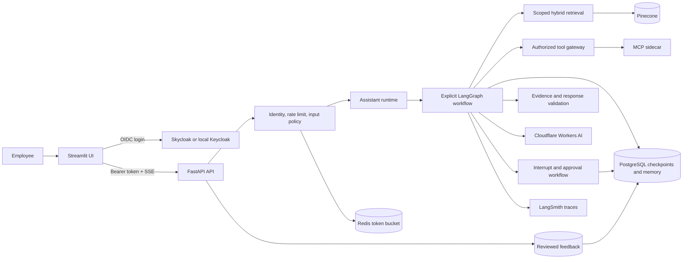

# Orysys — Product Architecture Specification

Companion plans:

- [`implementation-plan.md`](implementation-plan.md) defines the ordered backlog,
  module interfaces, tests, commits, deployment work, and operator verification.
- [`requirements-traceability.md`](requirements-traceability.md) maps every product
  requirement to code, verification, and operator evidence.
- [`research/dependency-health.md`](research/dependency-health.md) records dependency
  choices, maintenance evidence, licenses, and compatibility risks.

## 0.1 Product overview

Orysys is an enterprise knowledge assistant that gives grounded answers with evidence.
It serves three users: employee/viewer (asks policy and operations questions and reads
cited evidence), analyst (runs multi-document synthesis and constrained analytics over
authorized sources), and administrator (manages access and approves impactful actions).
The core job: return accurate, access-scoped answers where every claim links to
retrieved evidence, with visible execution, validation, and traces.

## 0.2 Design goals

- Grounded answers by default: citations to authorized evidence, validated before delivery.
- Access-scoped retrieval: identity, role, and filters enforced by the server on every query.
- Visible execution: states, retrieval, tool calls, validation, and errors shown in the UI and traces.
- Bounded research: recursive multi-document analysis with explicit depth, breadth, retrieval-call, token, and time budgets.
- Replaceable dependencies behind ports: models, search, memory, and telemetry can change without rewriting orchestration.

## 1. Executive decision

Build Orysys v1 as a **modular monolith** with a separate lightweight MCP
server process. Use FastAPI as the system boundary, Streamlit as a thin client,
LangGraph as the orchestration engine, Cloudflare Workers AI as the development
generation and embedding provider (default vendor; no OpenAI key required), Pinecone as the required search store, Neon Postgres
for deployed durable graph checkpoints, Redis for rate limiting, and upstream Keycloak
hosted by Skycloak for OIDC authentication. Cloudflare is called from FastAPI through
Python adapters using its OpenAI-compatible REST endpoint; it does not move the backend
to a Worker or introduce a JavaScript runtime. "OpenAI-compatible" below always means
the Cloudflare REST wire protocol, not the OpenAI vendor.

The architecture optimizes for the core product areas: agent
architecture, hybrid RAG, visible LangGraph execution, bounded recursive research,
security, and LangSmith traces. It also includes bounded implementations of the v1 extended
capabilities: multi-agent failure isolation (one agent or subtask failing should not crash or corrupt the whole request.), human approval, reranking, cross-session memory,
answer feedback, and Docker Compose. It deliberately avoids premature microservices,
arbitrary code execution, and model-controlled authorization.

## 2. Architecture principles

1. **Deterministic controls surround probabilistic decisions.** The model may propose
   an intent, plan, query, or tool call. Code validates and authorizes it.
2. **LangGraph orchestrates; it does not own the domain.** Graph nodes call small
   application services through typed ports. Retrieval, policy, and validation remain
   usable without LangGraph.
3. **Identity and access come from the server.** User ID, role, department, tenant,
   retrieval filters, and tool permissions never come from model output or request
   text.
4. **Evidence is a first-class data type.** Answers cite immutable evidence IDs, and a
   validator rejects citations not present in the authorized retrieval set.
5. **State is explicit and serializable.** Nodes return state deltas. There are no
   mutable globals, hidden session objects, or side effects inside routing functions.
6. **Recursion is bounded.** Every research run has depth, breadth, retrieval-call,
   token, and wall-clock budgets.
7. **Transparency is not chain-of-thought exposure.** The UI shows states, decisions,
   calls, evidence, validation outcomes, timing, and errors; it does not show private
   reasoning, secrets, or raw system prompts.
8. **Dependencies are adapters, not architecture.** LLM, vector search, memory, and
   telemetry providers sit behind interfaces and can be replaced.

## 3. System context



The rendered copy is [`diagrams/system-context.svg`](diagrams/system-context.svg),
generated from [`diagrams/system-context.mmd`](diagrams/system-context.mmd).

### Deployment units

- `api`: FastAPI, application services, LangGraph, adapters, and ingestion commands.
- `ui`: Streamlit. It owns presentation only and never calls Pinecone, the LLM, or
  enterprise tools directly. Native chat/status widgets remain the functional core;
  a small project-owned design-system package supplies tokens and the few visual
  components needed by this application.
- `mcp-server`: Dummy enterprise directory, service catalog, and incident tools.
- `postgres`: Core Compose PostgreSQL for conversations, rolling summaries,
  long-term memory, audits, feedback, and LangGraph checkpoints. Host port 55432
  avoids clashing with a local PostgreSQL on 5432; containers still use 5432.
- `keycloak`: An optional local Compose profile using the same exported realm as the
  Skycloak-hosted environment.
- `redis`: Distributed per-user token buckets and short-lived coordination data.
- External managed services: Cloudflare Workers AI, Pinecone, Neon Postgres, LangSmith,
  and Skycloak as the managed host for upstream Keycloak.

All local units run with Docker Compose. The same `DATABASE_URL` contract supports local
Postgres and Neon, so cloud availability is not required for unit and integration tests.
This is a process boundary plan, not a reason to split the Python code into networked
services internally.

## 4. Request and graph flow

1. FastAPI authenticates the request and constructs an immutable `UserContext`.
2. A Redis-backed token bucket consumes capacity for that user.
3. Input validation enforces size, schema, accepted content type, and safety policy.
4. The graph emits `run.started`, then the intent/planner produces a typed plan.
5. A deterministic router selects the direct RAG or bounded research path.
6. Retrieval always applies a server-built access filter before ranking, then the
   direct path runs deterministic `enrich_with_mcp` allow-list enrichment to add
   citable `mcp:*` evidence when the principal holds `mcp.read`.
7. Complex multi-document requests fan out into isolated research tasks
   (`plan`/`discover`/`partition`/`worker`/`reduce`/`retry_gaps`) and reduce
   structured findings.
8. The response node produces claims linked to evidence IDs. The Streamlit client
   renders the summary plus per-claim bullets, and the sidebar history picker
   reloads prior owner-scoped threads via `GET /v1/conversations`.
9. Validators check authorization, citations, response schema, and brand/safety rules.
10. One bounded repair attempt is allowed. A second failure returns an explicit,
    grounded partial answer or a safe failure.
11. The graph writes the conversation checkpoint and emits `run.completed`.

### Implemented top-level graphs

```text
Direct (src/orysys/graph/builder.py)
START
  -> input_policy
  -> understand_and_plan
  -> retrieve
  -> enrich_with_mcp
  -> compose_answer -+-> validate_answer -+-> finalize -> END
                     |                     +-> repair_once -> validate_answer
                     +-> safe_failure -> END

Research (src/orysys/research/runtime.py)
START -> plan -> discover -> partition -> worker -> reduce -> retry_gaps -> compose -> END
```

The defined agent roles map to graph responsibilities rather than four
free-running chatbots:

- **Supervisor:** structured intent, decomposition, and routing.
- **Retrieval specialist:** query variants, access-scoped hybrid retrieval, weighting,
  reranking with a deterministic fallback, and evidence creation.
- **Research specialist:** bounded recursive/fan-out analysis over document batches.
- **Response specialist:** answer composition from the evidence ledger only.

This produces clear agent boundaries without multiplying prompts and failure modes.

## 5. State and contracts

The graph state should contain identifiers and compact structured results, not entire
documents or unbounded logs.

```text
AssistantState
  request_id, thread_id
  user_context
  messages
  intent, research_plan, budgets
  retrieval_queries, evidence[]
  tool_requests[], tool_results[]
  findings[]
  validation_results[]
  answer
  errors[]
```

Important value objects:

- `UserContext(user_id, tenant_id, role, departments, clearance)`
- `AccessScope(namespace, metadata_filter, allowed_tools)`
- `Evidence(evidence_id, document_id, chunk_id, title, section, page, excerpt,
  hybrid_score, rerank_score, content_hash)`
- `ResearchPlan(tasks, max_depth, max_workers, deadline, token_budget)`
- `Claim(text, evidence_ids)`
- `ActivityEvent(sequence, type, node, public_payload, timestamp)`
- `ValidationResult(rule, passed, public_message)`

Use append-only reducers for evidence, findings, validation results, and errors. Dedupe
evidence by stable chunk ID before final composition. Do not persist streaming token
deltas in checkpoint state.

## 6. Hybrid retrieval and ingestion

### Index strategy

- Use one Pinecone vector index per environment with `dotproduct` similarity.
- Configure the first index for 1,024 dense dimensions. L2-normalize every
  Qwen3-Embedding-0.6B vector before upsert and query; this preserves cosine-style dense
  ranking while retaining the `dotproduct` metric Pinecone hybrid dense+sparse search
  uses.
- Use a namespace per tenant. Do not create namespaces per department or role.
- Store authorization fields in metadata and apply them to every query.
- Store both a dense vector and a corpus-fitted BM25 sparse vector on each chunk. Fit the
  sparse encoder on the actual corpus and persist its parameters with the corpus version.
- Query dense and sparse values together and apply an explicitly evaluated `alpha`
  weighting. Record the weighting, candidate count, filters, and hybrid score for the
  activity panel.
- Retrieve a wider candidate set, then rerank behind a `Reranker` port. If it fails,
  continue with hybrid order.

Current Pinecone guidance describes hybrid search as combining keyword and semantic
signals and supports one-index dense+sparse vector queries with client-side weighting.
Sparse and dense values require normalization/weighting rather than raw score addition.
Metadata filtering narrows the candidate set before ranking. See
[Pinecone hybrid search](https://docs.pinecone.io/guides/search/hybrid-search) and
[metadata filtering](https://docs.pinecone.io/guides/search/filter-by-metadata).

### Document and chunk schema

```text
tenant_id, document_id, version, chunk_id, parent_section_id
title, section_path, page_number, chunk_text
department, document_type, access_level, created_at_epoch
source_uri, content_hash, ingestion_run_id
```

Use structure-aware chunks with a configurable target size and small overlap. Tune the
numbers with retrieval evaluation rather than hard-coding a claimed universal optimum.
For v1, generate clean Markdown/JSON source documents with stable headings and
page/section metadata; add heavy PDF/OCR parsing only after the end-to-end path works.

The ingestion command must be idempotent: content hashes and deterministic chunk IDs
allow changed versions to be upserted and stale versions to be removed safely.

## 7. Bounded Recursive Language Model design

Do not execute model-generated Python. The planner returns a validated `ResearchPlan`
DSL, and trusted Python code executes that plan.

For a request such as an annual outage analysis:

1. Discover candidate documents with metadata and hybrid retrieval.
2. Partition stable document IDs into bounded batches.
3. Fan out per-batch subgraph calls, each with the same immutable access scope.
4. Each worker returns structured findings, evidence IDs, confidence, and errors.
5. Reduce findings by normalized root-cause key and deduplicate evidence.
6. If a gap is explicit and budget remains, allow one additional targeted recursion
   level.
7. Compose and validate the cross-document answer.

Initial safety limits should be configuration, with conservative defaults such as two
levels of depth, a small worker pool, a maximum retrieval-call count, and a request
deadline. A failed batch produces a partial-result marker; it does not cancel unrelated
batches. This is the main defense against multi-agent cascade failures.

## 8. Memory

- **Required short-term memory:** a PostgreSQL-backed LangGraph checkpointer keyed by a
  server-issued thread UUID. It stores conversation state across turns and survives
  process restarts.
- **Context control:** retain recent turns plus a validated rolling summary. Retrieve
  older turns only when relevant; do not continually send the complete conversation.
- **Long-term memory:** a separate application-owned store keyed by tenant and
  user for explicit preferences or user-approved facts. Every item has provenance,
  sensitivity, creation/expiry timestamps, and delete controls. Do not copy document
  contents, inferred sensitive attributes, or hidden reasoning into long-term memory.
- **Memory write policy:** only an explicit user request or a narrowly defined,
  confirmed preference may create a durable memory. The graph proposes a typed memory
  candidate; deterministic policy validates it before persistence.

LangGraph distinguishes thread-scoped checkpointers from cross-thread stores, and its
documentation recommends a persistent checkpointer such as PostgreSQL instead of
in-memory storage for durable use. See
[LangGraph persistence](https://docs.langchain.com/oss/python/langgraph/persistence).

## 9. Security model

### Authentication and authorization

Use the product requirement for open-source authentication with upstream Keycloak hosted by
Skycloak. The application integrates only through standard OIDC discovery and JWT/JWKS
validation, so the same configuration can target self-hosted Keycloak. Describe this in
product documentation as **Keycloak hosted by Skycloak**.

Streamlit initiates OIDC login with `st.login()` and exposes the access token only for
the API call. FastAPI independently validates issuer, audience, signature, expiry, and
the expected Keycloak client roles before constructing `UserContext`. It never trusts a
role or user ID sent as ordinary request data. The three required roles map to
capabilities:

| Capability | Viewer | Analyst | Administrator |
|---|---:|---:|---:|
| Chat and authorized search | yes | yes | yes |
| Python analytics | no | yes | yes |
| Read-only MCP tools | no | yes | yes |
| Administrative tools | no | no | yes, with approval when impactful |

Enforce this twice: when exposing tools to the model and again in the tool gateway at
execution time. The second check is authoritative.

Use Keycloak client roles named `viewer`, `analyst`, and `administrator`. Keep a local
Keycloak Compose profile plus an exportable realm configuration for portability, and
use locally signed token fixtures for automated tests. Do not require a live identity
provider in unit tests. Avoid a Keycloak admin SDK in the request path; the API needs
only cached OIDC discovery/JWKS data and a maintained JWT verification library.

### Prompt injection and exfiltration controls

- Treat user text and retrieved text as untrusted data.
- Use a fixed instruction hierarchy and clearly delimited evidence payloads.
- Never let retrieved text alter tools, permissions, identity, namespaces, or filters.
- Validate every tool call with a strict Pydantic schema, allow-list, timeout, and output
  size limit.
- Permit only configured outbound hosts; redact credentials and sensitive fields from
  logs and traces.
- Limit verbatim excerpts and reject requests to reveal prompts, secrets, hidden state,
  or unauthorized source content.
- Record suspicious inputs and retrieved instructions as validation events, but do not
  rely on a prompt-injection classifier as the sole control.

### Python analysis

Implement named analytical operations over structured records, such as grouping
incidents by root cause or calculating recurrence counts. Do not provide `eval`, `exec`,
a shell, arbitrary imports, filesystem access, or network access. A real sandbox is an
optional production extension, not required for v1.

### Human approval

Place a LangGraph interrupt immediately before any simulated impactful administrator
action. The approval payload must be JSON-serializable, and pre-interrupt side effects
must be idempotent because interrupted nodes restart on resume. See
[LangGraph interrupts](https://docs.langchain.com/oss/python/langgraph/interrupts).

## 10. Streaming and explainability

Expose one FastAPI server-sent-events endpoint with a versioned event schema:

```text
run.started
node.started / node.completed
retrieval.started / retrieval.completed
tool.requested / tool.completed / tool.denied
memory.updated
validation.completed
answer.delta
run.completed / run.failed
```

Events carry sequence numbers and correlation IDs so the Streamlit client can render a
stable activity timeline. Event payloads use public summaries and counts, never hidden
reasoning or secrets. The answer token stream and activity stream share the connection.

LangGraph supports async state, message, task, subgraph, and custom streaming; Streamlit
can consume an iterable with `st.write_stream`. See
[LangGraph streaming](https://docs.langchain.com/oss/python/langgraph/streaming) and
[Streamlit streaming](https://docs.streamlit.io/develop/api-reference/write-magic/st.write_stream).

### Project-owned Streamlit design system

Use the same source-ownership idea that makes shadcn useful, adapted to Python:

- semantic tokens for background, foreground, border, muted, success, warning, error,
  spacing, radius, and typography;
- native `st.chat_message`, `st.chat_input`, `st.write_stream`, and `st.status` wrapped
  behind project functions, not reimplemented;
- only the bespoke pieces v1 needs: `RoleBadge`, `AgentStateBadge`,
  `ActivityTimeline`, `EvidenceCard`, `ValidationResult`, `ToolCallCard`, and
  `EmptyState`;
- a small allow-listed Lucide SVG registry sourced from a pinned official Lucide release;
- no CSS selectors that depend on Streamlit's generated internal class names;
- no user, document, model, or tool text interpolated into unsafe HTML.

The design-system layer may import Streamlit. Feature/application modules must not
import design-system internals, and the design system must know nothing about LangGraph,
Pinecone, or authentication. Components receive typed view models only.

Streamlit's current OIDC support can expose an access token when explicitly configured;
the UI passes it as a bearer token to FastAPI and never logs or persists it. See
[Streamlit OIDC authentication](https://docs.streamlit.io/develop/api-reference/user/st.login).

## 11. Observability and evaluation

- Enable LangSmith for the entire graph and add explicit spans around retrieval fusion,
  MCP calls, analytics, authorization decisions, and validation.
- Attach `request_id`, anonymized `user_id`, role, route, model, prompt version, corpus
  version, and retrieval configuration as trace metadata.
- Use `structlog` JSON logs with the same correlation fields.
- Redact or omit credentials, raw tokens, and restricted document bodies before trace
  export. Keep full source data in the application, not telemetry.
- Create a small curated LangSmith dataset before prompt tuning.
- Mirror prompt snapshots to LangSmith Hub for visibility; the serving path uses the pinned git copy only and never pulls prompts at runtime.
- Capture explicit thumbs-up/down feedback plus an optional note against `run_id`,
  trace ID, prompt/model/corpus versions, route, and cited evidence IDs. Store it in
  Postgres and provide an export job that creates a reviewed LangSmith evaluation
  dataset; never auto-train or change prompts directly from raw feedback.

Required evaluation cases:

- direct answer with citations;
- exact identifier that needs BM25;
- paraphrase that needs dense search;
- multi-document annual incident synthesis;
- follow-up question using session memory;
- viewer attempting an analyst/admin tool;
- prompt injection in user input and in a retrieved document;
- hallucinated citation attempt;
- LLM, Pinecone, MCP, reranker, and memory failures.

Measure retrieval recall@k, citation validity/precision, answer groundedness, policy
bypass count, task success, latency, and token/cost totals. LangSmith supports both
offline datasets/experiments and online evaluation; start with deterministic code
evaluators, then use an LLM judge only for qualities that code cannot measure. See
[LangSmith evaluation](https://docs.langchain.com/langsmith/evaluation).

## 12. Failure policy

| Failure | Behavior |
|---|---|
| LLM timeout/rate limit | bounded retry with jitter; then safe error or configured fallback |
| Dense search fails | continue with keyword results and disclose degraded retrieval |
| Keyword search fails | continue with dense results and disclose degraded retrieval |
| Pinecone unavailable | do not fabricate an answer; return service-unavailable guidance |
| Reranker fails | use Pinecone hybrid order |
| One research batch fails | aggregate successful batches and label incompleteness |
| MCP fails/times out | omit tool result, preserve document answer if sufficient |
| PostgreSQL checkpoint fails | finish the current turn if safe; disclose memory is unavailable |
| Redis unavailable | fail closed for protected deployments; explicit in-memory dev mode only |
| Citation validation fails | one repair; then partial answer or insufficient-evidence response |

Retries belong at adapter boundaries and apply only to transient, idempotent operations.
Use typed domain errors and translate them to stable API error codes at the FastAPI
boundary.

## 13. Codebase layout and patterns

```text
.
├── pyproject.toml
├── uv.lock
├── src/orysys/
│   ├── api/                 # routes, dependencies, SSE and error mapping
│   ├── application/         # use cases and orchestration-facing services
│   ├── domain/              # identity, policy, evidence, errors, value objects
│   ├── graph/               # state, builder, routes, nodes, subgraphs
│   ├── ports/               # Protocol interfaces for external capabilities
│   ├── adapters/            # Cloudflare, Pinecone, Postgres, Redis, MCP, LangSmith
│   ├── retrieval/           # query, fusion, reranking, citation construction
│   ├── tools/               # registry, authorization gateway, analytics tools
│   ├── ingestion/           # loaders, chunking, metadata, index upserts
│   ├── config.py
│   └── bootstrap.py         # one composition root
├── ui/                      # thin Streamlit application
│   └── design_system/
│       ├── tokens.py        # semantic tokens; no feature/provider knowledge
│       ├── theme.py         # one controlled CSS/theme entry point
│       ├── icons.py         # allow-listed Lucide SVG registry
│       └── components/      # status, activity, evidence, role, empty states
├── mcp_server/              # separate dummy enterprise MCP process
├── data/sample/             # synthetic, stable evaluation corpus
├── tests/
│   ├── unit/
│   ├── integration/
│   ├── contract/
│   └── security/
├── evals/                   # datasets, evaluators, experiment runner
├── docs/
│   ├── adrs/
│   ├── research/
│   ├── threat-model.md
│   └── operations.md
└── compose.yaml
```

Code rules:

- Use `Protocol` ports and explicit constructor injection; no DI framework.
- Graph nodes are thin async functions and contain no vendor SDK calls.
- Network clients are created once in FastAPI lifespan and closed cleanly.
- Pydantic models define API, graph, event, plan, tool, and adapter boundaries.
- Routing and authorization functions are pure and exhaustively unit tested.
- Prompts are versioned files or constants next to their node, with structured output
  schemas and regression tests.
- Avoid `utils.py`, catch-all service classes, dictionaries crossing every boundary,
  and imports from adapters into domain/application modules.
- Pin the full dependency lock for the pilot release. Upgrade only through a tested dependency
  change.

## 14. Implementation sequence

### Milestone 0 - Foundations and contracts

- Initialize Git and a public-repo-safe `.gitignore`/`.env.example`.
- Add package/tooling configuration, typed domain contracts, fake adapters, and CI.
- Commit the graph/event schemas, access matrix, threat assumptions, and synthetic
  corpus before adding vendor integrations.

### Milestone 1 - Safe vertical slice

- Ingest a small corpus into Pinecone.
- Implement access-scoped dense + BM25 sparse retrieval, tuned hybrid weighting,
  evidence objects, and citations.
- Run one direct-RAG graph path through FastAPI SSE into Streamlit.
- Enable LangSmith and structured logs from the first end-to-end request.

### Milestone 2 - Agent and RLM depth

- Add structured supervisor routing, retrieval and response subgraphs.
- Add bounded plan/fan-out/reduce research and the constrained Python analytics tool.
- Demonstrate partial batch failure and stable aggregation.

### Milestone 3 - Controls and persistence

- Add Skycloak-hosted Keycloak OIDC, role/tool policy, metadata authorization, Redis
  token bucket, PostgreSQL checkpointer, input/output guards, and citation validation.
- Add the MCP sidecar and a human approval interrupt for an impactful simulated tool.

### Milestone 4 - Quality and deliverables

- Add failure injection, security tests, integration tests, and LangSmith evaluation.
- Add the bounded long-term-memory flow: propose, confirm, store, retrieve, expire, and
  delete, with tenant/user isolation tests.
- Add thumbs-up/down feedback, optional notes, audit metadata, and reviewed export to a
  LangSmith evaluation dataset.
- Finish the architecture diagram, README, assumptions/trade-offs, trace examples, and
  operator verification notes.

## 15. Release scope decisions

### v1

- Required three Keycloak client roles via Skycloak OIDC, plus local test-token fixtures.
- Pinecone namespaces, metadata access filters, dense + BM25 sparse retrieval, evaluated
  hybrid weighting, and reranking.
- Direct RAG and one bounded recursive research route.
- Knowledge search, constrained Python analytics, and a small MCP server.
- PostgreSQL session memory, Redis token bucket, LangSmith tracing.
- Explicit, consent-based long-term memory with provenance, expiry, and deletion.
- Answer-quality feedback linked to runs/traces and an evaluation-dataset export path.
- SSE chat and a public activity timeline.
- Citation, authorization, injection, input, tool, and response validation.
- Docker Compose, tests, evaluation dataset, and documentation.

### v1.1 candidates

- Automated feedback triage dashboards and richer preference-management workflows.
- Production identity hardening beyond the required Keycloak integration,
  OpenTelemetry/Prometheus, and richer parsing/OCR.

### Non-goals

- Kubernetes, Kafka, Celery, a service mesh, multiple vector databases, autonomous
  unbounded agents, arbitrary Python/shell execution, or a custom frontend framework.

### Decisions on proposed products

| Proposal | Decision | Reason |
|---|---|---|
| `truevis/aifab-facade` | Do not depend on the playground repository | It is a small showcase for the upstream `streamlit-facade` package, not the package itself. |
| `streamlit-facade` | Reference only; do not add as a runtime dependency | Reuse its useful ideas—tokens, presets, small wrappers—but implement only the components this app needs. Native Streamlit owns chat, streaming, and status behavior. |
| [Lucide](https://github.com/lucide-icons/lucide) | Adopt a small, pinned static SVG subset | Use the official MIT-licensed icon set, keep an allow-listed project registry, and record the source version. Do not add a JavaScript runtime or accept arbitrary icon/HTML input. |
| Zilliz Cloud / Milvus | Do not use in v1 | It supports hybrid/full-text search, but the product requirement is a single search store for v1: Pinecone. The `HybridRetriever` port keeps a later migration possible without carrying two vector databases in v1. |
| Neon | Adopt for the deployed Postgres target | It is standard managed Postgres and can back durable checkpoints/memory through the normal connection string. Keep local Postgres in a Compose profile for reproducibility. |
| Cloudflare Workers AI | Adopt for development generation and embeddings | Use `@cf/qwen/qwen3-30b-a3b-fp8` (default generation, 32K context) and `@cf/qwen/qwen3-embedding-0.6b` (1,024 dims, chunk cap 2,000 tokens) through async Python REST adapters. `@cf/zai-org/glm-4.7-flash` (131K context) is an evaluated alternate via named config, not auto-retry. Free plan is 10,000 Neurons/day (reset 00:00 UTC, $0.011/1K beyond, $5/mo paid minimum); `glm-5.x` and listed frontier models are paid-only. Function calling is beta — validate plan/tool args with Pydantic JSON Schema. Token stays server-side; per-run budgets sit below the daily pool (text ~300 RPM, embeddings ~3,000 RPM). |
| ORM / migrations | Start without an ORM; use Alembic only for application-owned tables | LangGraph's Postgres checkpointer manages its own persistence. Small feedback/audit repositories can use Psycopg with typed row mapping; adopt SQLAlchemy only if the relational model becomes complex enough to justify it. |
| Auth0 | Do not use in v1 | It is a sound product, but it does not match the product requirement for Keycloak-compatible OIDC once Keycloak is available. |
| [Skycloak](https://skycloak.io/docs/integrations/introduction/) | Adopt as managed upstream Keycloak | This satisfies the open-source Keycloak option while avoiding identity-server operations. Use only portable OIDC/JWKS integration and keep a local Keycloak realm/profile so managed hosting is replaceable. |

The linked [`aifab-facade`](https://github.com/truevis/aifab-facade) repository describes
itself as a playground for the MIT-licensed upstream
[`streamlit-facade`](https://github.com/itsdaniyalm/streamlit-facade). The upstream is a
small, early project, so use it as visual reference rather than a dependency. This is
still shadcn-style ownership: component source and tokens live in our repository and
are tailored to our application instead of hidden behind an opaque UI package.
Zilliz Cloud is a managed Milvus service with hybrid and full-text features, but those
capabilities do not override the product requirement for Pinecone as the single search
store for v1. Neon supports
standard Python Postgres drivers including Psycopg 3 and asyncpg; this design selects
Psycopg 3 because the LangGraph Postgres checkpointer already uses that ecosystem. See
[Zilliz Cloud](https://docs.zilliz.com/docs/home) and
[Neon Python connectivity](https://neon.com/docs/guides/python).

Cloudflare's Vercel AI SDK integration is for JavaScript/TypeScript Workers, not this
Python/FastAPI backend. The application instead uses Workers AI's OpenAI-compatible
protocol endpoints through a project-owned async adapter. This keeps provider
concerns at the adapter seam, preserves LangGraph/LangSmith integration, and permits a
generic OpenAI-protocol fallback (different base URL/key, off by default) without changing graph nodes. See
[Workers AI OpenAI compatibility](https://developers.cloudflare.com/workers-ai/configuration/open-ai-compatibility/),
[pricing](https://developers.cloudflare.com/workers-ai/platform/pricing/), and
[Workers AI errors](https://developers.cloudflare.com/workers-ai/platform/errors/). Do not send real customer data to Workers AI in v1; use synthetic documents. Do not claim regional residency from the base product.

## 16. Operator verification plan

Verify behavior directly against the running stack, not slides alone:

1. A viewer asks a grounded policy question and opens its evidence.
2. An analyst asks the annual payment-outage question; the activity panel shows plan,
   fan-out batches, partial findings, aggregation, and validation.
3. A follow-up proves thread memory without repeating the original question.
4. Exact error-code search demonstrates the BM25 contribution; a paraphrase demonstrates
   dense contribution.
5. A viewer attempts an analyst/MCP tool and is denied by the server-side policy.
6. A retrieved prompt-injection document is treated as evidence, not instruction.
7. A controlled MCP or reranker failure demonstrates graceful degradation.
8. LangSmith displays the same run with nested graph, retrieval, and tool traces.
9. Close with measured eval results and explicit assumptions/trade-offs.

## 17. Open decisions to settle with a short compatibility spike

- Exact pinned versions after installing the candidate dependency set together.
- Pinecone index dimension, candidate count, BM25 fitting strategy, hybrid `alpha`, and
  reranker choice, settled through the retrieval evaluation set rather than intuition.
- Cloudflare model availability, daily allocation, and acceptable request budget; keep the
  selected model IDs in settings and run the provider compatibility suite before verification.
- The maximum request deadline and RLM budgets.

The dependency-health report in `docs/research/dependency-health.md` records current
maintenance, release, license, and compatibility evidence for the candidate stack.

## Appendix A — Brief-to-spec mapping

This specification covers the originating solution brief spanning RAC, MEM, TOOL, and related capability areas; ID-level coverage is tracked in requirements-traceability.md.
